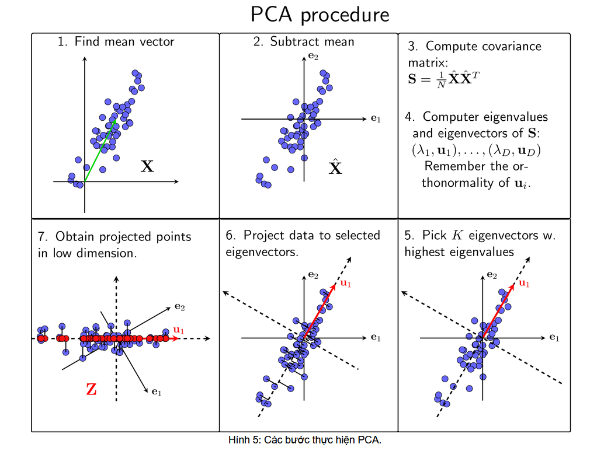
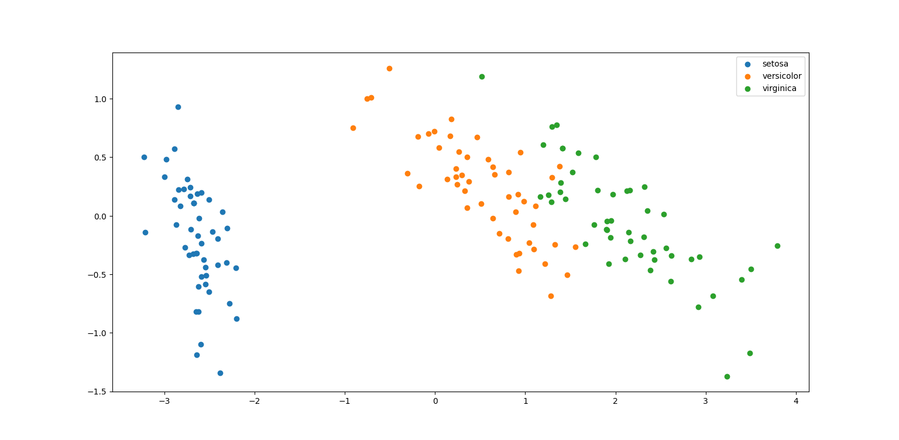

# Thuật toán giảm chiều dữ liệu PCA


## Vì sao cần giảm chiều dữ liệu?

Dùng để trực quan dữ liệu, đưa dữ liệu về không gian mới, khám phá các thuộc tính ẩn mà chiều dữ liệu ban đầu không nói rõ, đồng thời tăng tốc độ thực thi cho máy tính

## Thuật toán PCA (Principal component analysis)



## Các thư viện cần thiết

`import numpy as np`: thực hiện các phép toán với ma trận

`import pandas as pd`: xử lý khung dữ liệu

`from matplotlib import pyplot as plt`: trực quan hóa dữ liệu

## Các bước thực hiện PCA

Giả sử X là ma trận đầu vào, lần lượt thực hiện các bước sau:

- Tính vector kỳ vọng của toàn bộ dữ liệu:
$$\bar{x} = \frac{1}{N} \sum_{n=1}^{N} x_n$$

```python
mean = np.mean(X, axis=0)
```

- Trừ mỗi điểm dữ liệu đi vector kỳ vọng của toàn bộ dữ liệu:
$$\hat{x}_n = x_n - \bar{x}$$

```python
X = X - mean
```

- Tính ma trận hiệp phương sai:
$$\mathbf{S} = \frac{1}{N} \mathbf{\hat{X}} \mathbf{\hat{X}}^T$$

```python
cov = X.T.dot(X) / X.shape[0]
```

- Lấy chỉ số index của trị riêng từ lớn đến nhỏ, rồi chọn k vector riêng (k thành phần chính) tạo ma trận U tương ứng với k index đã tìm được.

```python
select_index = np.argsort(eigen_values)[::-1][:k]
U = eigen_vectors[:, select_index]
```

- Chiếu dữ liệu ban đầu đã chuẩn hoá của X
xuống không gian con U tìm được.
Dữ liệu mới chính là toạ độ của các điểm dữ liệu trên không gian mới.
$$\mathbf{Z} = \mathbf{U^T_K} \mathbf{\hat{X}}$$

```python
X_new = X.dot(U)
```

**Với tập dữ liệu [iris.csv](data/iris.csv), ta có thể triển khai như sau:**

```python
import numpy as np
import pandas as pd
from matplotlib import pyplot as plt

class PCA:
  def __init__(self, n_dimention: int):
    self.n_dimention = n_dimention

  def fit_transform(self, X):
    mean = np.mean(X, axis=0)
    X = X - mean
    cov = X.T.dot(X) / X.shape[0] 
    eigen_values, eigen_vectors, = np.linalg.eig(cov)
    select_index = np.argsort(eigen_values)[::-1][:self.n_dimention]
    U = eigen_vectors[:, select_index]
    X_new = X.dot(U)
    return X_new
    
if __name__ == "__main__":
  df = pd.read_csv(r"iris.csv")
  X = df[["sepal_length", "sepal_width", "petal_length", "petal_width"]].to_numpy()
  Y = df["species"].to_numpy()

  pca = PCA(n_dimention=2)
  new_X = pca.fit_transform(X)
  
  for label in set(Y):
    X_class = new_X[Y == label]
    plt.scatter(X_class[:, 0], X_class[:, 1], label=label)

  plt.legend()
  plt.show()
```

**Trực quan hóa dữ liệu trong không gian hai chiều:**



## Tài liệu tham khảo

[https://viblo.asia/p/ml-from-scratch-thuat-toan-giam-chieu-du-lieu-pca-7ymJXKMa4kq](https://viblo.asia/p/ml-from-scratch-thuat-toan-giam-chieu-du-lieu-pca-7ymJXKMa4kq)

[https://phamdinhkhanh.github.io/deepai-book/ch_ml/PCA.html](https://phamdinhkhanh.github.io/deepai-book/ch_ml/PCA.html)
